

        

# Persistamp 🐢
## A Motivational 'Good Habits' Positivity App

**TOC** || [About](#about-persistamp) ● [Features](#features) ● [How It Works](#how-it-works) ● [Development](#development) ● [Contact Us](#contact-us)

**Try the app!** *(Includes demo mode)*  

**This productivity-'positivity' app**  
**promotes good habits with positive reinforcement! 🌱**  
Create and keep track of your good habits. 🖍️  
Analyze habit trends over time. 💯  
Stay motivated by creating rewards in a reward shop. 🎁  
Earn points by keeping up good habits. 💎  
Redeem those hard-won points on rewards! 🧾  
<!-- 🎀🌻🌷🌼   -->

## About Persistamp

[[ https://persistamp.herokuapp.com ]](https://persistamp.herokuapp.com)  
*(Inspired by mobile app [Loop Habit Tracker](https://play.google.com/store/apps/details?id=org.isoron.uhabits&hl=en_US&gl=US).)*

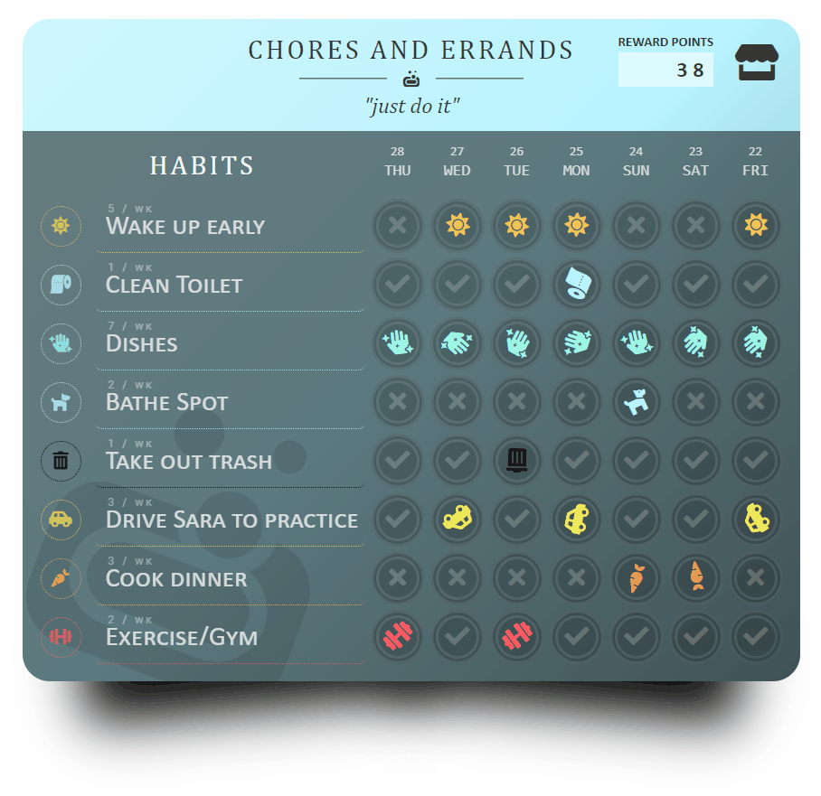

Persistamp's design is inspired by reward cards and sticker reward systems. The visually playful 'program card' system, emulating the style of loyalty reward cards, is meant to encourage users to track their habits by 'stamping' successful days on their personalized cards. The user can view each habit's history analytics, such as a line graph, calendar, and statistics like longest streak.

With each stamp, the user gains points for the program the habit is included in. A program's reward shop can be stocked by the user with their own custom reward ideas ex. 'Take a day off', 'Enjoy a pumpkin spice latte', 'Play games for 1 hour', and set their cost, quantity, and custom color/icon appearance. Redeemed rewards are displayed for posterity in a receipt-style log as 'proof of their purchase'.

## Features

* Create custom categories for habits with 'program cards'.
* Add habits to programs, then stamp off every day a habit is fulfilled. 
* Set a habit's 'frequency'. Checkmarks will show when the week's goal is fulfilled.
* Earn a 'reward point' for every habit stamp.
* View a habit's history analytics through provided statistics, a line graph, and mini-calendar.
* Share a habit's details or keep it private with a 'Public-Private' toggle.
* Each program features a reward shop. Create rewards with a custom cost and (opt) quantity.
* Use a program's points to redeem rewards. See it logged in a redemption history.
* Drag-n-drop to manually sort programs, habits, and rewards.
* Customize the appearance of programs, habits, and rewards with a choice of color and icon.

### Future Stretch Goals
- **Add friends**
- **Accountability buddies**
- **Messaging**
- User Profile page
- Public/private user profile, programs
- Custom frequency options to allow from 'out of any number', rather than only by 'week'. Ex. '3 days out of 30'.
- Dark/light mode
- (low) Option to archive and hide-archive habits.
- (low) Adding addition display types (see above options in MVP). Ideally at least three total (high), max of five (low)

## How It Works
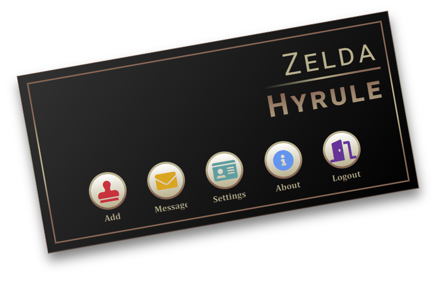

***Tip:** This ID card also works as the site's main navigation.*  
*Note the **red button**; it has many important uses, depending on the webpage.*

>
> **Users can:**
> 1. [Make a program card](#1-make-a-program-card)
> 2. [Add good habits](#2-add-good-habits)
> 3. [Stamp successful days](#3-stamp-successful-days)
> 4. [View habit history & details](#4-view-habit-history-and-details)
> 5. [Create rewards](#5-create-rewards)
> 6. [Redeem rewards with points](#6-redeem-rewards-with-points)
>

### 1. Make a program card

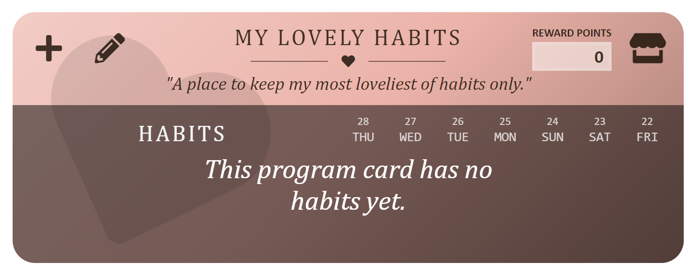

- To **create a program**, click the red + 'Add' button on your ID Card in the top-left corner.
- Add a title, description (optional), color, and icon. 
- To **edit or delete a program**, click the pencil in the program's top-left corner (it will appear when you hover/click the card).
- ***Tip:** The color and icon of new programs default to your user setting icon and settings! Click the green 'Settings' button to change them.*
<!-- - Tip! Change the order of programs with drag-n-drop. -->

 

> **Program Ideas?**
> * Exercise, Mental Health, Healthy Diet
> * Chores, Errands, Adulting Tasks
> * Learning, Self-teaching, Self-improvement
> * Social Obligations, Networking, Time for Loved Ones

<!--  -->

### 2. Add good habits
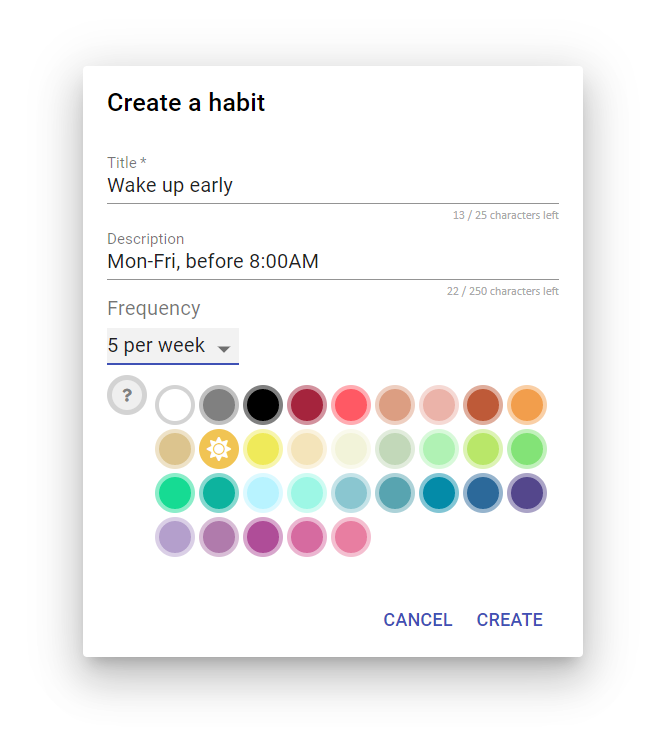
<!--  -->
<!--  -->

  

- To **create a habit**, click the + icon in the program card's top-left corner (hover/click card to see).
- Add a title, description (optional), color, and icon. Tip: The color and icon default to the program's color/icon settings!
- **Select a frequency.** How many days per week is your goal?
- To **edit or delete a habit**, click the circled icon on the habit's left side.
- Tip! Change the order of habits with drag-n-drop.

 
>
> **Habit Ideas?**
> * Chores: do the dishes, wash laundry, cook a healthy meal, take out trash
> * Socially: call mom, check e-mail, apply to jobs, send thank-you letters
> * Hobbies: read a book, draw for 10 minutes, bake bread, try a new recipe
> * Avoiding bad habits: don't smoke, don't doomscroll more than 30min, don't eat junk food
>

 

### 3. Stamp successful days 
<!--  -->

- To **add a stamp**, click empty spots in the habit card to mark the day fulfilled for that habit.
- To **undo a stamp**, reclick the stamp.
- If you have enough stamps for a **habit's frequency goal**, any unstamped spots will now **show a checkmark**.
- **Note!** You can only add stamps for within the last seven days, so check in at least once a week.

### 4. View habit history and details
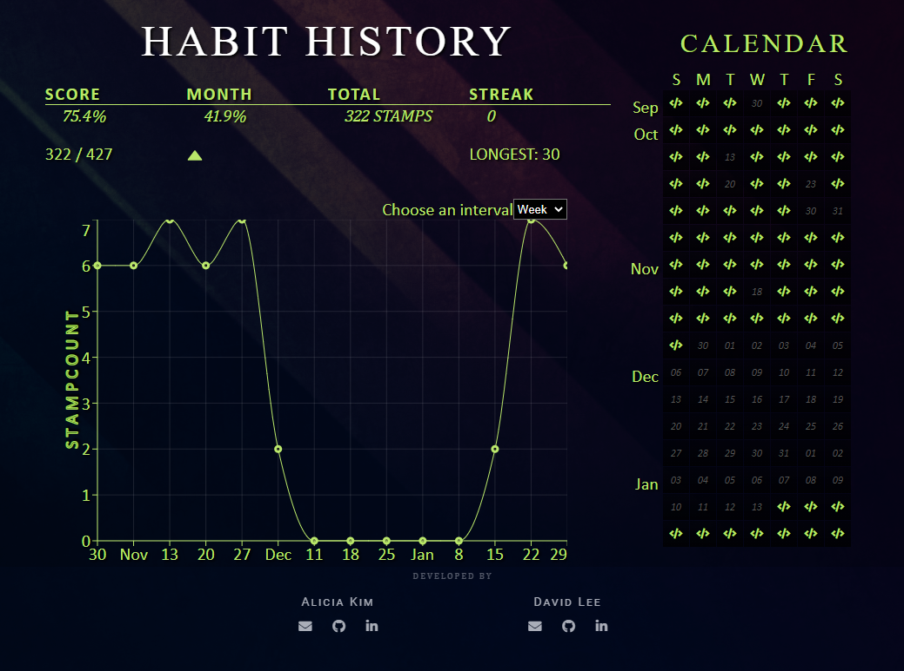

- To **see a habit's 'details page'**, click the name of a habit.
- **See the habit's general information** in the top-right corner.
- For the line graph, select from the dropdown to **toggle between 'monthly' and 'weekly' view**.
- The habit can be **edited** from this page too, with your ID card's red stamp.
- **Note about privacy!** Check the top-right area to find a 'Private' toggle. This setting allows or restricts other people from being able to see this page.
<!-- - Add notes explaining the types of scores, their meanings. -->
 

<!--  -->
<!--  -->
<!--  -->

 

### 5. Create rewards

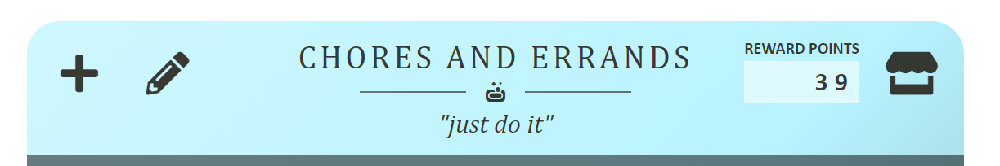

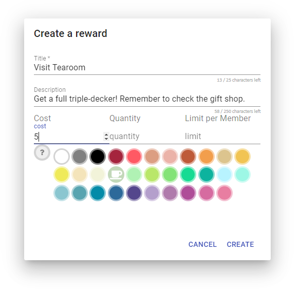
 

- **To *see a program's reward points and shop*, click the _shop icon_ at the top-right corner of a program card.**
- To **create a reward**, when in the reward shop, click the red trophy icon on your ID card.
- Add a title, description (optional), color, and icon. 
- **Decide the point cost of the reward.**
- (Optional) Specify an available quantity for the reward. Leave it blank for no limit.
- To **edit or delete a reward**, click the pencil in the reward certificate's top-left corner.
- ***Tip:** The color and icon default to the program's color/icon settings!*
<!-- - (Optional) Specify a 'limit per member' so that no one program's member can redeem more than a set amount of it. -->

 

>
> **Reward Ideas?**
> * Something yummy, like a snack, favorite drink, or candy.
> * A guilt-free present to yourself, like a book, a new laptop, or flowers.
> * 'Fun time' - Watch a movie, 2 hours of video games, free internet time.
> * A dream vacation, time off work, or a night out on the town!
>

 

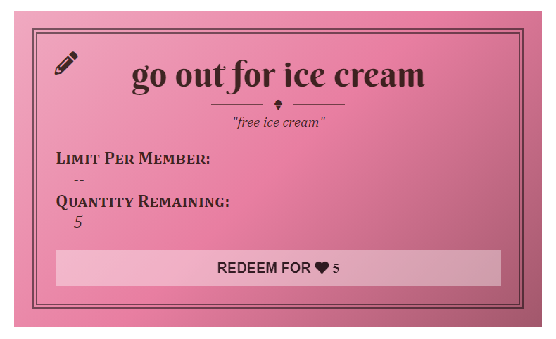
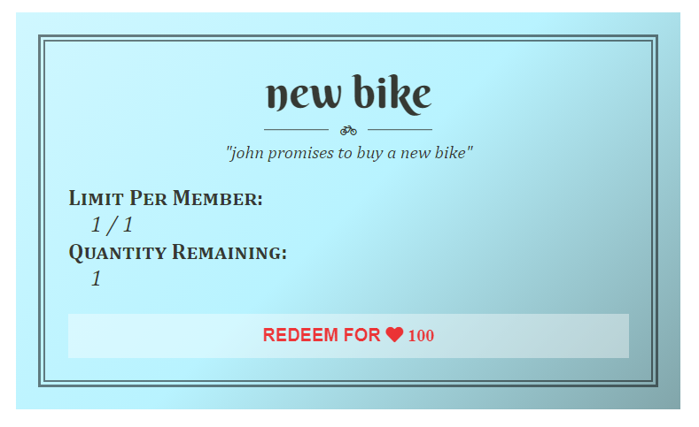
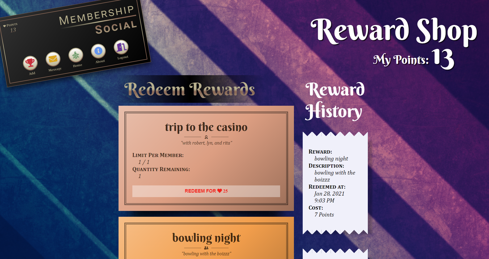

<!-- 
 -->

### 6. Redeem rewards with points

- To **redeem a reward**, click the 'Redeem' button on a reward certificate.
- Confirm that you really want to redeem this reward, and the cost will be taken out from your points.
- **See previously redeemed rewards**, including when they were redeemed, in the shop's Receipts History.
- Indulge yourself in your redeemed reward, whatever it may be, or show the receipt to whoever will treat you for it <3 .
- If a reward is **unable to be redeemed** (not enough points, zero quantity), the Redeem button will show red and be unclickable.
- **Note!** There are no refunds! All reward shop sales are final :) .

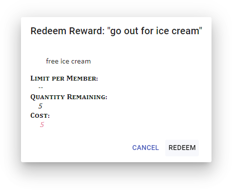
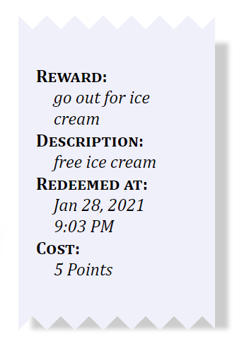

 

## Development
**TOC** [Technologies](#technologies) ● [Models](#models) ● [Routes](#routes) ● [Wireframes & Styling](#wireframes-and-styling) ● [Dev Snapshots](#development-snapshots)

This section details the technical aspects of this project's development.

### Technologies
- JavaScript
- Python 3
- React
- CSS
- Alembic
- SQLAlchemy
- Psycopg2
- PostgreSQL
- Visual Studio Code
- Flask-WTF, WTForms
- Werkzeug
- recharts
- beautiful-react-dnd
- Marshmallow-SQLAlchemy

### Wireframes and Styling

**(TBA - Wireframe sketches from during the design process)**

- **Title Ideas** PersiStamp or Persistamp (Persistent/Stamp)
- **Logo Ideas** A turtle stamp
- **Aesthetic - Keywords, Ideas** Colorful but modern. Analog-feel of paper, stamps, traditional materials, sticky notes/journals, 'reward boards', et cetera? Chalkboard?
- **Fonts** Berkshire Swash (Google), Cambria (headers), Calibri...
- **Colors** Colorful and friendly. Accommodate any color scheme well to allow user flexibility, since they can customize the color and look of a lot of the visual elements of the site.

### Models
The database schema evolved and changed quite a bit continually throughout the process to accommodate new ideas, cleaner pipelines, and future features. A few examples exist of the schemas we drew up during the process, but likely by the time of this reading, the models written here are somehow out of date.

**Original Schema and a Mid-development Schema**

 
 

**TABLES LIST**
- users
- memberships
- programs
- habits
- stamps
- rewards
- redeemed
- colors
- icons
- bonds

#### `users`
| users      | Constraints                                   |
|------------|-----------------------------------------------|
| id         | SERIAL, PRIMARY KEY                           |
| first_name | VARCHAR(25) NOT NULL                          |
| last_name  | VARCHAR(25) NOT NULL                          |
| username   | VARCHAR(25) NOT NULL |
| birthday   | DATE |
| email      | VARCHAR(320), NOT NULL, UNIQUE                 |
| hashword   | VARCHAR(255) NOT NULL                         |
| color_id   | FOREIGN KEY(colors.id), NOT NULL |
| stamp_id   | FOREIGN KEY(stamps.id), NOT NULL |
| pids_order | ARRAY(INTEGER), NOT NULL, DEFAULT VALUE=[] |
| is_private | BOOLEAN, NOT NULL, DEFAULT VALUE=False |
| created_at | TIMESTAMP, NOT NULL, DEFAULT VALUE=new Date() |

#### `programs`
| columns   | Constraints                              |
|-----------|------------------------------------------|
| id        | SERIAL, PRIMARY KEY                      |
| title     | VARCHAR(25), NOT NULL |
| description | VARCHAR(250) |
| color_id   | FOREIGN KEY(colors.id), NOT NULL |
| stamp_id   | FOREIGN KEY(stamps.id), NOT NULL |
| hids_order | ARRAY(INTEGER), NOT NULL, DEFAULT VALUE=[] |
| rew_ids_order |  ARRAY(INTEGER), NOT NULL, DEFAULT VALUE=[] |
| is_private | BOOLEAN, NOT NULL, DEFAULT VALUE=False |
| creator_id | INTEGER, FOREIGN KEY=users.id, NOT NULL |
| created_at | TIMESTAMP, NOT NULL, DEFAULT VALUE=new Date() |

#### `memberships`
| columns   | Constraints                              |
|-----------|------------------------------------------|
| id        | SERIAL, PRIMARY KEY                      |
| program_id | INTEGER, FOREIGN KEY=programs.id, NOT NULL |
| member_id  | INTEGER, FOREIGN KEY=users.id, NOT NULL |
| stamper_id | INTEGER, FOREIGN KEY=users.id           |
| points     | INTEGER, NOT NULL, DEFAULT VALUE=0 |

#### `habits`
| habits      | Constraints                                   |
|-------------|-----------------------------------------------|
| id          | SERIAL, PRIMARY KEY                           |
| title       | VARCHAR(25), NOT NULL                         |
| description | VARCHAR(250)                                  |
| frequency   | INTEGER, NOT NULL, DEFAULT VALUE=1            |
| color_id    | FOREIGN KEY(colors.id), NOT NULL |
| stamp_id    | FOREIGN KEY(stamps.id), NOT NULL |
| program_id  | INTEGER, FOREIGN KEY=programs.id, NOT NULL    |
| creator_id  | INTEGER, FOREIGN KEY=users.id, NOT NULL       |
| created_at  | TIMESTAMP, NOT NULL, DEFAULT VALUE=new Date() |

#### `stamps`
| columns     | Constraints                                   |
|-------------|-----------------------------------------------|
| id          | SERIAL, PRIMARY KEY                           |
| date        | DATE, NOT NULL                                |
| status      | VARCHAR(25), NOT NULL, DEFAULT VALUE="unstamped" |
| member_id   | INTEGER, FOREIGN KEY=users.id, NOT NULL       |
| habit_id    | INTEGER, FOREIGN KEY=habits.id, NOT NULL      |

#### `rewards`
| columns | Constraints                          |
|---------|--------------------------------------|
| id      | SERIAL, PRIMARY KEY                  |
| type    | VARCHAR(25), DEFAULT VALUE="custom"  |
| title   | VARCHAR(50), NOT NULL                |
| description | VARCHAR(250) |
| cost     | INTEGER, NOT NULL, DEFAULT VALUE=5  |
| color_id   | FOREIGN KEY(colors.id), NOT NULL |
| stamp_id   | FOREIGN KEY(stamps.id), NOT NULL |
| limit_per_member | INTEGER, NOT NULL, DEFAULT VALUE=-1 |
| quantity | INTEGER, NOT NULL, DEFAULT VALUE=1  |
| program_id | INTEGER, FOREIGN KEY=programs.id  |
| creator_id | INTEGER, FOREIGN KEY=users.id |
| created_at | TIMESTAMP, DEFAULT VALUE=new Date() |

#### `redeemed`
| user_rewards | Constraints                               |
|--------------|-------------------------------------------|
| id           | SERIAL, PRIMARY KEY                       |
| user_id      | INTEGER, FOREIGN KEY=users.id, NOT NULL   |
| reward_id    | INTEGER, FOREIGN KEY=rewards.id, NOT NULL |
| redeemed_at  | TIMESTAMP, DEFAULT VALUE=new Date(), NOT NULL |

### `bonds`
| columns  | Constraints                             |
|----------|-----------------------------------------|
| id       | SERIAL, PRIMARY KEY                     |
| user_id  | INTEGER, FOREIGN KEY=users.id, NOT NULL | combo-unique
| buddy_id | INTEGER, FOREIGN KEY=users.id, NOT NULL |

### Routes

#### Frontend
| METHOD | Route Path | Purpose         |
|--------|------------|-----------------|
| GET    | `/`        | splash page, if no auth |
| GET    | `/`        | user homepage, if auth checks |
| GET    | `/about`   | about page |
| GET    | `/logout`  | logout user |
| GET    | `/habits/:hid/memberships/:mid` | habit history page for a user's habit (public/private options) |
| GET    | `/programs/:pid/memberships/:mid/rewards` | reward shop for a user and program |
<!-- | GET    | `/users/:uid` | user's public profile page | -->
<!-- | GET    | `/users/:uid/redeemed` | user's redeemed reward history | -->
<!-- | GET    | `/programs/:pid/redeemed` | user's redeemed reward history for a program | -->
<!-- | GET    | `/users/:uid/bonds` | user's bonds | -->

#### Backend
##### ROOT: `/users`
| METHOD | Route Path | Purpose         |
|--------|------------|-----------------|
| POST   | `/`        | Validate signup and make new user account. |
| GET    | `/:uid`     | Get `user` information |
| PATCH  | `/:uid`     | Authenticate and edit `user` details |
| DELETE | `/:uid`     | Delete a `user` account |
| GET    | `/:uid/auth` | Not sure, but I think we may need a route just to check auth? |
| GET    | `/:uid/programs` | Get all a `user`'s subscribed `programs`. |
| GET    | `/:uid/redeemed` | Get all a `user`'s `redeem`ed rewards. |
<!-- | GET    | `/:uid/bonds` | Get all a `user`'s `bond`s. | -->
<!-- | POST   | `/:uid/bonds` | Create a `bond` with another `user`. | -->
<!-- | DELETE | `/:uid/bonds/:bid` | Delete a `bond` with a `user`. | -->
<!-- | GET    | `/:uid/redeemed/:type` | Get all a `user`'s `redeem`ed rewards of a specific `type`. | -->

##### ROOT: `/programs`
| METHOD | Route Path | Purpose         |
|--------|------------|-----------------|
| POST   | `/`        | Create a new `program`.    |
| GET    | `/:pid`    | Get a `program`'s details. |
| PATCH  | `/:pid`    | Edit a `program`.   |
| DELETE | `/:pid`    | Delete a `program`. |
| GET    | `/:pid/stampers` | Get all a `program`'s `stamper`s. |
| GET    | `/:pid/stampers/:uid` | Get a specific `stamper` and the member(s) they are accountable for. | 

##### ROOT: `/programs/:pid/members`
| METHOD | Route Path | Purpose         |
|--------|------------|-----------------|
| GET    | `/`        | Get a `program`'s `member`s. |
| POST   | `/:uid`    | Add a `member` to the `program`. |
| DELETE | `/:uid`    | Delete a `member` from the `program`. | 
| GET    | `/:uid/habits` | Get a `member`'s `habit`s for a `program`, including last seven days of history for each. |
| GET    | `/:uid/habits/:hid` | Get a `user` `habit`'s details, including full history (via `stamp_checks`) |
| GET    | `/:uid/stamper` | Get a `member`'s `stamper` in the `program`.
| PATCH  | `/:uid/stamper` | Change a `member`'s `stamper` in the `program`.
| DELETE | `/:uid/stamper` |  Unassign the assigned `stamper`.

##### ROOT: `/programs/:pid/habits`
| METHOD | Route Path | Purpose         |
|--------|------------|-----------------|
| GET    | `/`        | Get all a `program`'s `habits`, including last seven days of history for each. |
| GET    | `/:hid`    | Get a `habit`'s details, including full histories for from all members (via `stamp_checks`) |
| POST   | `/`        | Create a `habit` for a `program`. |
| PATCH  | `/:hid`    | Edit a `habit` for a `program`. |
| DELETE | `/:hid`    | Delete a `habit` for a `program`. |

##### ROOT: `/programs/:pid/habits/:hid/members/:uid`
| METHOD | Route Path | Purpose         |
|--------|------------|-----------------|
| POST   | `/stamp`   | Change status of associated `daily_stamp` to 'stamped' |
| DELETE | `/`     | Change status of associated `daily_stamp` to 'unstamped' |
| POST   | `/ping`     | Change status of associated `daily_stamp` to 'pending' | 

##### ROOT: `/rewards`
| METHOD | Route Path | Purpose         |
|--------|------------|-----------------|
| GET    | `/`        | Get all default rewards. |
| GET    | `/:type`   | Get all rewards of a specific type. | <-- default-permanent options only

##### ROOT: `/programs/:pid/rewards`
| METHOD | Route Path | Purpose         |
|--------|------------|-----------------|
| GET    | `/`        | Get all a `program`'s custom `reward`s. |
| POST   | `/`        | Create a new custom `reward`. |
| PATCH  | `/:rid`    | Edit a custom `reward`.    |
| DELETE | `/:rid`    | Delete a custom `reward`.  | 
| POST   | `/:rid/redeem/users/:uid` | Redeem a `reward` for a `user` | <-- effects points

<!--
| METHOD | Route Path | Purpose         |
|--------|------------|-----------------|
|  |  |  |
|  |  |  |
|  |  |  | 
-->

### Development Snapshots

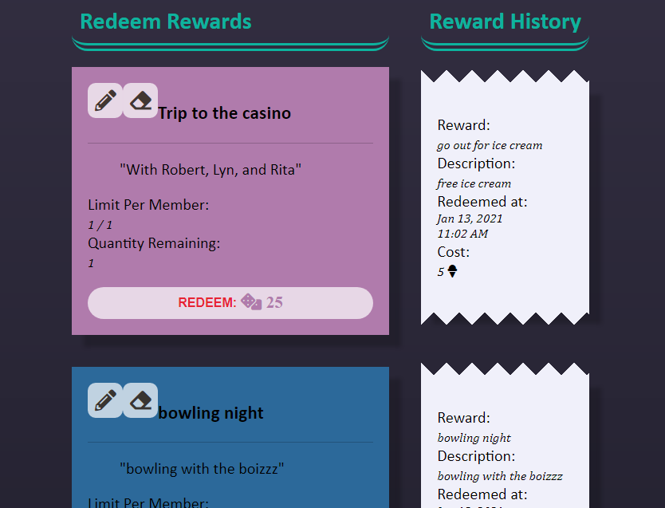

  <!-- - red-violet-crayola: #af4d98ff;
  - wild-orchid: #d66ba0ff;
  - pastel-pink: #e5a9a9ff;
  - dutch-white: #f4e4baff;
  - celeste: #baf2e9ff;
  - granny-smith-apple: #b0f2b4ff;
  - magic-mint: #9df7e5ff;
  - blizzard-blue: #b8f3ffff;
  - middle-blue: #8ac6d0ff;
  - cadet-blue: #58a4b0ff;
  - dark-slate-blue: #54478cff;
  - sapphire-blue: #2c699aff;
  - blue-munsell: #048ba8ff;
  - keppel: #0db39eff;
  - medium-aquamarine: #16db93ff;
  - light-green: #83e377ff;
  - inchworm: #b9e769ff;
  - corn: #efea5aff;
  - maize-crayola: #f1c453ff;
  - sandy-brown: #f29e4cff; -->

---

## Contact Us

Thank you for taking a look at Persistamp! :) We are both actively job-seeking full-stack developers. Please feel free to reach out and ask us anything.

**David Lee** *(Full-stack developer, Open to work)*  
    
 
**Alicia Mira Kim** *(Full-stack developer, Open to work)*  
       
