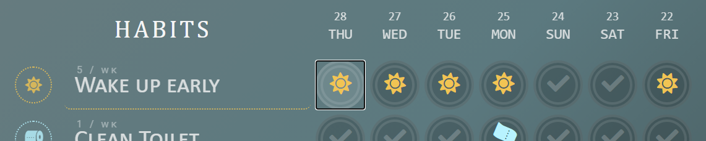

<div align="center">

 

 

 

 

  

 

 


# Persistamp 🐢

## A Motivational 'Good Habits' Positivity App

**TOC**  
[About](#about-persistamp) ● [Features](#features) ● [How It Works](#how-it-works) ● [Installation](#installation) ● [Development](#development) ● [Contact Us](#contact-us)

**This 'productivity-positivity' app**  
**promotes good habits with positive reinforcement! 🌱**  
Create and keep track of your good habits. 🖍️  
Analyze habit trends over time. 💯  
Stay motivated by creating rewards in a reward shop. 🎁  
Earn points by keeping up good habits. 💎  
Redeem those hard-won points on rewards! 🧾  
<!-- 🎀🌻🌷🌼   -->


### Try the Demo!
<a href="https://persistamp.herokuapp.com/"></a>

</div>

---

<div align="center">

## About Persistamp

[[ WEBSITE: https://persistamp.herokuapp.com ]](https://persistamp.herokuapp.com)  
*(Inspired by mobile app [Loop Habit Tracker](https://play.google.com/store/apps/details?id=org.isoron.uhabits&hl=en_US&gl=US).)*

</div>


Persistamp's design is inspired by reward cards and sticker reward systems. The visually playful 'program card' system, emulating the style of loyalty reward cards, is meant to encourage users to track their habits by 'stamping' successful days on their personalized cards. The user can view each habit's history analytics, such as a line graph, calendar, and statistics like longest streak.

With each stamp, the user gains points for the program the habit is included in. A program's reward shop can be stocked by the user with their own custom reward ideas ex. 'Take a day off', 'Enjoy a pumpkin spice latte', 'Play games for 1 hour', and set their cost, quantity, and custom color/icon appearance. Redeemed rewards are displayed for posterity in a receipt-style log as 'proof of their purchase'.

<br clear="both">

## Features
</div>

* Create custom categories for habits with 'program cards'.
* Add habits to programs, then stamp off every day a habit is fulfilled. 
* Set a habit's 'frequency'. Checkmarks will show when the week's goal is fulfilled.
* Earn a 'reward point' for every habit stamp.
* View a habit's history analytics through provided statistics, a line graph, and mini-calendar.
* Share a habit's details or keep it private with a 'Public-Private' toggle.
* Each program features a reward shop. Create rewards with a custom cost and (opt) quantity.
* Use a program's points to redeem rewards. See it logged in a redemption history.
* Customize the appearance of programs, habits, and rewards with a choice of color and icon.
<!-- * Drag-n-drop to manually sort programs, habits, and rewards. -->

### Future Stretch Goals
- **Add friends**
- **Accountability buddies**
- **Messaging**
- User Profile page
- Public/private user profile, programs
- Custom frequency options to allow from 'out of any number', rather than only by 'week'. Ex. '3 days out of 30'.
- (low) Option to archive and hide-archive habits.

<div align="center">

## How It Works


***Tip:** This ID card also works as the site's main navigation.*  
***Note the red button!** It has many important uses, depending on the webpage.*

</div>

>
> **Users can:**
> 1. [Make a program card](#1-make-a-program-card)
> 2. [Add good habits](#2-add-good-habits)
> 3. [Stamp successful days](#3-stamp-successful-days)
> 4. [View habit history & details](#4-view-habit-history-and-details)
> 5. [Create rewards](#5-create-rewards)
> 6. [Redeem rewards with points](#6-redeem-rewards-with-points)
>

### 1. Make a program card


- To **create a program**, click the red stamp icon labeled 'Add' on your ID Card in the top-left corner.
- Add a title, description (optional), color, and icon. 
- To **edit or delete a program**, click the pencil in the program's top-left corner (it will appear when you hover/click the card).
- ***Tip:** The color and icon of new programs default to your user setting icon and settings! Click the green 'Settings' button on your ID card to change them.*
<!-- - Tip! Change the order of programs with drag-n-drop. -->

> **Program Ideas?**
> * Exercise, Mental Health, Healthy Diet
> * Chores, Errands, Adulting Tasks
> * Learning, Self-teaching, Self-improvement
> * Social Obligations, Networking, Time for Loved Ones

<br clear="both">

<div align="center">
  
</div>


### 2. Add good habits

<!--  -->
<!--  -->

- To **create a habit**, click the + icon in the program card's top-left corner (hover/click card to see).
- Add a title, description (optional), color, and icon. 
- **Select a frequency.** How many days per week is your goal?
- To **edit or delete a habit**, click the circled icon on the habit's left side.
- ***Tip:** The color and icon default to the program's color/icon settings!*
- ***Tip:** Change the order of habits with drag-n-drop.*

> **Habit Ideas?**  
> * Chores: do the dishes, wash laundry, cook a healthy meal, take out trash
> * Socially: call mom, check e-mail, apply to jobs, send thank-you letters
> * Hobbies: read a book, draw for 10 minutes, bake bread, try a new recipe
> * Avoiding bad habits: don't smoke, don't doomscroll more than 30min, don't eat junk food

<br clear="both">


### 3. Stamp successful days 
<!--  -->

- To **add a stamp**, click empty spots in the habit card to mark the day fulfilled for that habit.
- To **undo a stamp**, reclick the stamp.
- With enough stamps for a **habit's frequency goal**, any unstamped spots will now **show a checkmark**.
- ***Warning!** You can only add stamps for within the last seven days, so check in at least once a week.*




### 4. View habit history and details


- **To see a habit's 'details page', click the name of the habit in its program card.**
- **See the habit's general information** in the top-right corner.
- To **toggle between 'monthly' and 'weekly' view** for the line graph, select an option from the dropdown.
- The habit can be **edited** from this page with your ID card's red pencil icon.
- ***Note about privacy!** Check the top-right area to find a 'Private' toggle. This setting allows or restricts other people from being able to see this page. To **share your a detail page**, check that 'Private' is untoggled, then copy-paste the page's URL.*
<!-- - Add notes explaining the types of scores, their meanings. -->
<br>
<div align="center">

</div>
<!--  -->
<!--  -->
<!--  -->

<br clear="both">

### 5. Create rewards

<div align="center">

</div>

<br>

- **To *see a program's reward points and shop*, click the _shop icon_ at the top-right corner of a program card.**
- To **create a reward**, when in the reward shop, click the red trophy icon on your ID card.
- Add a title, description (optional), color, and icon. 
- **Decide the point cost of the reward.**
- (Optional) Specify an available quantity for the reward. Leave it blank for no limit.
- To **edit or delete a reward**, click the pencil in the reward certificate's top-left corner.
- ***Tip:** The color and icon default to the program's color/icon settings!*
- ***Note:** The 'limit per member' option is included for a future feature that allows more than one person to subscribe to a program. It ensures that no one program's member can redeem more than a set amount of that reward. Leave it blank to default to no limit.*

>
> **Reward Ideas?**
> * Something yummy, like a snack, favorite drink, or candy.
> * A guilt-free present to yourself, like a book, a new laptop, or flowers.
> * 'Fun time': Watch a movie, 2 hours of video games, free internet time.
> * A dream vacation, time off work, or a night out on the town!
>

<br clear="both">

<div align="center">


</div>


### 6. Redeem rewards with points

- To **redeem a reward**, click the 'Redeem' button on a reward certificate.
- Confirm that you really want to redeem this reward, and the cost will be taken out from your points.
- **See previously redeemed rewards**, including when they were redeemed, in the shop's Reward History.
- Indulge yourself in your redeemed reward, or show the receipt to whoever will treat you for it. 💞
- ***Note:** If a reward is **unable to be redeemed** (not enough points, zero quantity), the Redeem button will show red and be unclickable.*
- ***Note:** There are no refunds! All reward shop sales are final ;D .*
- ***Warning!** It is possible to **go into debt with negative points** for a program by buying rewards, then removing more stamps from the program card than there are remaining points. Debt must be made up before earning new points.*


<div align="center">

## Installation

</div>

1. Clone this repository.

   ```bash
   git clone https://github.com/alimirakim/persistamp.git
   ```

2. Install dependencies.

      ```bash
      pipenv install --dev -r dev-requirements.txt && pipenv install -r requirements.txt
      ```

3. Create a `.env` file based on the example with proper settings for your
   development environment.
   
4. Setup your PostgreSQL user, password, and database and make sure it matches your `.env` file.

5. Get into your pipenv, migrate your database, seed your database, and run your flask app.

   ```bash
   pipenv shell
   ```

   ```bash
   flask db upgrade
   ```

   ```bash
   python seeder.py
   ```

   ```bash
   flask run
   ```

6. To run the React App in development, `cd` into the `react-app` directory, then run `npm start`.

> 
> **IMPORTANT!**
>    If you add any python dependencies to your pipfiles, you'll need to regenerate your requirements.txt before deployment.
>    You can do this by running:
> 
>    ```bash
>    pipenv lock -r > requirements.txt
>    ```
> 
> **ALSO IMPORTANT!**
>    psycopg2-binary MUST remain a dev dependency because you can't install it on apline-linux.
>    There is a layer in the Dockerfile that will install psycopg2 (not binary) for us.
> 


<div align="center">

  ## Development

  **DEV TOC**  
  [Technologies](readme/development.md#technologies) ● [Concepts](readme/development.md#concepts) ● [Models](readme/development.md#models) ● [Routes](readme/development.md#routes) ● [Wireframes](readme/development.md#wireframes) ● [Dev Snapshots](readme/development.md#development-snapshots)

  This section is kept in a separate document [HERE](readme/development.md).  
  It details the technical aspects of this project's development.  
  A few sample snapshots are below from the development process.  

  
  
  

</div>

---

<div align="center">

  ## Contact Us

  Thank you for taking a look at Persistamp! :D  
  Please feel free to reach out and ask us anything.

</div>

### David Lee 
*(Full-stack developer, Open to work)*  
<a href="readme/Lee_David_Resume.pdf" download></a> 
[](mailto:dyclee@umich.edu) 
[](https://www.linkedin.com/in/daveyclee/) 
[](https://angel.co/u/david-lee-332) 
[](https://github.com/dyclee)
 
### Alicia Mira Kim 
*(Full-stack developer, Open to work)*  
<a href="readme/Kim_Mira_Alicia_Resume.pdf" download></a> 
[](mailto:alicia.mira.kim@gmail.com) 
[](https://aliciamirakim.com) 
[](https://www.linkedin.com/in/alicia-mira-kim-416a0a41) 
[](https://angel.co/u/alicia-mira-kim) 
[](https://alimirakim.github.io) 
[](https://github.com/alimirakim) 
